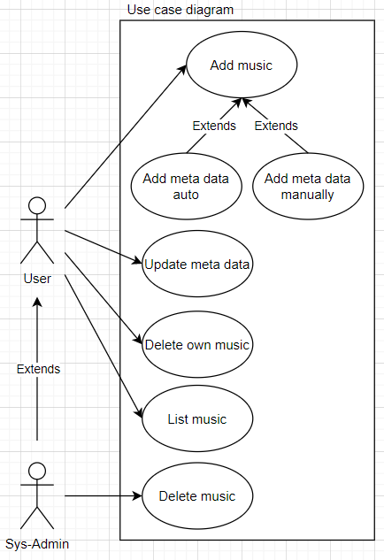

## 2.1 Noun- and verb analysis
Using the system description as a basis, the group performed a noun- and verb-analysis, in which the nouns could be possible classes and the verbs possible system functionalities.

| Nouns         | Verbs   |
|---------------|---------|
| API           | Stream  |
| Website       | Upload  |
| Music         | Deliver |
| Application   | Convert |
| Metadata      | Request |
| Server        | Add     |
| Mp3           | Make    |
| Video         | Consist |
| User          |         |
| Administrator |         |
| Thumbnail     |         |
| Artist        |         |
| Producer      |         |

The verb/noun-analysis helped to clarify some of the required core actors- and functionalities, that should be implemented in the system.

## 2.2 API and Website
To make the service available to the rest of the system it could be implemented as a microservice API. The API exposes endpoints that can be utilized by the website which represents the rest of the system. This website will be handled by another team and hooked up to the API's endpoints. To accommodate this client-server communication data will be sent between them in the form of JSON. To get data automatically, the system will also make use of external APIs to acquire metadata from videos, as well as downloading them.

## 2.3 Use Cases
A use case diagram was developed based on the actors and functionalities found during the verb/noun-analysis to clarify who will interact with the system and how.

### 2.3.1 Add music
The purpose of the system is to make music sharing possible within an online-community. Therefore, a feature could be the ability to transfer music from a user to the system, from where it becomes accessible to the rest of the community. For it to be easily accessible, the content must have a searchable identifier. This would advantageously be a title, such as the song-name, which will be used during client searches. The backend identifier on the other hand would be a unique ID, which will be used when playing the chosen song. Furthermore, the content must have relevant metadata associated with it, to make differentiation of content easier during these client search requests.

Since music is getting imported from an external service, which often contains some existing metadata, it should be possible to develop an auto-scan function. This would strengthen the user-experience by automatically gathering existing metadata from the source, and presenting it to the client. Furthermore, it must be possible to edit the metadata manually, in case it is of low quality or missing entirely.

#### 2.3.1.1 Getting files
When developing a system, it is a good idea to reuse existing functionality instead of rewriting everything from scratch, as long as the existing functionality does not break system requirements. With this in mind, it was decided to use existing, external APIs for acquiring the requested music-videos and getting their related metadata. Based on the link supplied by the client, an external API will be called to download the video, and another API will be called to get the metadata. Once the server has converted the MP3-files, and its related data has been acquired, it will be stored in the system’s database and fileserver.

### 2.3.2 Delete music
For the system to be free from audio not classified as music, there should be a system administrator for the system. This administrator should have the means to delete non-music from the system and the coupled metadata. It should also be possible for the user to delete their own music that they have uploaded, but not to delete music that other people have uploaded. When a song is deleted, it should become unavailable but stay in the database (soft delete). This would make it possible to check if a song has been uploaded and deleted, to prevent a possible reupload.

### 2.3.3 User types / system permissions
It is important to distinguish between the user types to assure the roles and permissions for the different users. The system could have two primary actors with different privileges: One would be the user, which has the ability to add new music, update and delete its own music. The second one would be an administrator with access to the same features, plus the option to delete others' music. It should be noted that the administrator would not administrate users, but only their music.

### 2.3.4 Update metadata
In the case of a user adding the wrong metadata or misspelling anything, it could be possible to edit the metadata after a song has been added to the system. The metadata in the database and search engine would then be updated to reflect the edited data.

### 2.3.5 Primary use case
The most important use case was chosen and formalized in a use case description to illustrate the underlying functionality and workflow. Since the primary concern of the system is adding music to the platform, the group chose to focus on this case and its success scenario.

| Use case: Add Music |
|--------|
| ID: 01 |
| Primary actor: User |
| Secondary actor: |
| Short description:   Converts video from external service to mp3 |
| Preconditions:   The desired video, exists on the external platform   The desired video has to be publicly accessible |
| Main flow:   1) User inserts a link to a video hosted on an external service   2) Metadata & thumbnail is obtained from a music service if available   3) User presses the “upload” button   4) An API converts the given music video, to mp3 format   5) The mp3 file gets uploaded to the platform and the metadata is saved in the system |
| Postconditions:   The system has converted the video to mp3 and saved it in the database, without degrading music quality |
| Alternative flow:   2a) User inserts the metadata manually if it isn’t available through the API   4a) If the metadata indicates that the video is not categorized as music, the upload is denied |

## 2.4 Data quality
When allowing users to upload data to the website, there has to be a certain level of data quality to uphold. If users are allowed to upload anything they want, it can be exploited, so there must be limitations:

1) The first limitation is that only music can be uploaded to the platform. This way the content of the platform becomes more focused, and it is made sure that certain types of metadata should be available. E.g. titles, authors, genres.

2) The second limitation is that a song can only be uploaded to the platform once. This ensures that the data repository does not get filled with multiple copies of the same song.

### 2.4.1 Music only
To make sure that only music is uploaded on the platform, the system must be able to decide what kind of video is being uploaded. Conveniently, YouTube already puts categories on their content, which can be read from their video API. When a video is uploaded to the platform, the system can check whether the video is in the music category or not. If it is not in the music category, the upload will not be completed.

### 2.4.2 No duplicated music
To make sure that the same music is only uploaded to the platform once, the system must be able to uniquely identify every song. To accommodate this there could be made checks on different levels: The first check is whether the specific link was already uploaded. Then the system will check whether a song with the same title and author is already present in the database. By making these two checks the system can approximately decide whether the music is already in the system. A further check could be made by hashing the files, but that would only fail if the files had the exact same lengths and content, which is unlikely.

### 2.4.3 Flagging system
To combat some of the content that might not be music, or does not belong on the service, a flagging/report system should be implemented. A user would then have the option to report a song for not being appropriate. A sys-admin would then get a list of music that has been flagged as non-music and remove the song if necessary.

### 2.4.4 Sound quality
To maintain the sound quality, the system must be able to convert the music from YouTube at the highest, non-premium quality YouTube provides, i.e. 126kbps. 
The average song length is about 3-6 minutes long which, according to Colincrawley.com [[5]](/References#5-audio-file-size-calculator), is around 3.0MB to 5.5MB in file size at 126kbps. By estimating that the download speed is at least 2MB/s and assuming an average file size of (3.0MB + 5.5MB)/2 = 4.25Mb, the optimal download time is then calculated to 4.25Mb/2Mb/s = 2.1s.
By testing how long conversion could take, via a similar solution: yt-download.org [[6]](/References#6-typical-youtube-mp3-downloader-with-specifik-link-for-conversion-test), an average conversion time can be estimated to around 10 seconds. After having converted the music, downloaded it, and added it to the system, it should be available to the rest of the system, within 15 seconds.