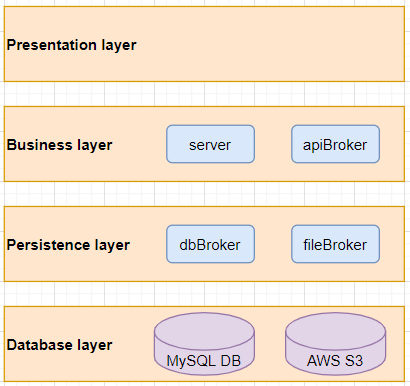

## 4.1 Microservice Architecture
The microservice itself has been layered in the following monolithic structure:

Since the microservice does not provide any graphic user interface the presentation layer is empty. This layer’s components will be filled by other services, which will use this microservice for data processing and storage.

The reason for this layered architecture is twofold: First and foremost, the architecture adheres to the separation of concerns principle, which states that each section of a system should be focused on a specific area of expertise. Each section hereby encapsulates some related functionality that can be easily accessed by the rest of the system and maintained by the developers. Secondly, the broker pattern makes sure that functions that are used to contacting other services are bundled together into their own focused component. This component is now focused enough that the specific implementation can easily be changed. If for example, the system needed to change the type of database which is used, the group would only need to change the dbBroker component and leave the rest of the system as is. In this way, the entire system becomes easier to maintain and expand, if the need should arise in the future.

## 4.2 Class Diagram

Since the system is a part of a larger microservice-based application, the system needs a centralized service point for communicating with the rest of the system. This service point is the server class, which defines possible GET and POST endpoints that can be used by the other services. Through these endpoints, the service will handle downloading, converting the music file, and storing the associated metadata from YouTube. To separate the endpoint exposing functionality from the data handling functionality, a series of broker classes was implemented. This enables for easier replacement of functionality or integration with different APIs. The same logic is applied for storing data in a database and uploading files to the fileserver. To enable storage of the music and its metadata, the classes “Metadata” and "Music" were created. The Music class is a way of capturing all information about a piece of music, and its corresponding metadata, which can then be stored in the database.

## 4.3 Sequence Diagram

This sequence diagram visualizes the connection between a user and the system for the "add music" use case. The system first checks whether the inserted link complies with requirement R3; "Music Only", which checks if the link actually is music. This is done through the apiBroker, which collects metadata information about the link, including its YouTube category, which indicates whether it is music or not. This test is made at the start of the conversion and upload-process to optimize the execution time, by checking whether the requirement is met before allowing further conversion of the music, which would be a resource-intensive task. If the link is evaluated to be invalid music, an error message will be sent to the client, in the form of a "NotMusicMessage". If the link is validated as music the process will continue. The music will be converted and saved as an MP3 file through the fileBroker and afterward, the metadata will be saved in the database through the dbBroker. Since the file conversion is a resource-intensive task, it is made sure that the conversion is 100% done before saving anything to the database. If the metadata was inserted into the database before the file was ready, the remaining system would show the music as playable, before the file would be accessible. This way it is made sure that all the data is available before making anything available to the rest of the system. 

## 4.4 Entity-Relationship Diagram

The ER Diagram details the different tables of the database and how they relate to each other. The main tables that support the systems data model are the Music and Metadata tables, and the MetaDataToMusic relation table the binds them together. The tables and relations have been normalized, so every entity type has its own table, and no values are repeated across multiple tuples. This is a major benefit for the system, in terms of scaling and optimization, since as little data is stored as possible, which in turn permits more tuples reusing the unique data. Normalizing data makes it possible to store every unique value only once, instead of inserting it every time it appears in the metadata. Every unique value of an entity, like the authors or genres, then has its own ID, which gets referred to by the metadata tuples.
To further enhance the data model, a MusicStorage table was added, which isolates information about where the music is stored from the information about the music itself. Furthermore, a MusicLog table was added to save information about when the music was saved to the database, which can be used when supplying data to the rest of the system. When the "Data Search" team asks for updates on what music is in the database, it is hereby possible to send only the newest additions, instead of the entire music catalog.