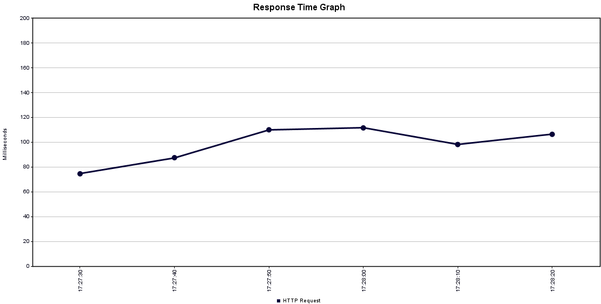

## 6.1 Requirement tests
To validate that the system lives up to the requirements stated in the specification, the following acceptance- and performance-tests were performed. Since only the requirements for R1 and R3 were implemented, their sub-requirements will be tested and validated.

### 6.1.1 R1-1
The music metadata must be stored in a database.

Procedure:
1. Add music through the UI, by entering a link, and confirming the pulled metadata
1. After successfully uploading a song, open the database through the docker container
1. Choose the database mediaAcquisition
1. Run a “Select * from Music”, to confirm that the corresponding YouTube ID has been inserted
1. For further testing, run through the different tables, connected to Metadata, to confirm that the related metadata has been stored

Results:

Having uploaded a link with the YouTube-id; "qrO4YZeyl0I", it is possible to conclude whether the exact video has been registered by looking at the stored IDs. Furthermore, the third table confirms that the different metadata-fields have been connected to the different entities. The second table shows that the group successfully created a complete music-entity with all its expected values.

### 6.1.2 R1-2
The system must be able to save an MP3 file from an external service.

Procedure:
1. Add music through the UI, by entering a link, and confirming the pulled metadata
1. To check the file server, its port must first be exposed with the following command in cmd - “kubectl port-forward deployment/minio 9000:9000”.
1. The file server can now be visited on localhost:9000/minio
1. Check whether a file with the expected name is available

Results:

The test passed and was confirmed by checking the file server, which had the 3 expected files downloaded and stored inside it. The file names in the server are the unique IDs associated with each music video link, which was possible to confirm matched up with the content intended to download.

### 6.1.3 R1-3
Users must be able to manually add metadata to the music file.

Procedure:
1. Add music through the UI, by entering a link, and confirming the pulled metadata
1. Pick some of the data fields and change them, then proceed by uploading 
1. After successfully uploading a song, open the database through the docker container
1. Choose the database mediaAcquisition
1. Run a “Select * from music”, metadata, and other related tables, with the added meta title as an argument, to confirm that the self-written data has been inserted

Results:

 

The first image above shows the metadata-fields with custom text inserted. It shows that every value gets correctly distributed to the different variables. The next image confirms that the transferring and storing happens successfully.

### 6.1.4 R1-4
If metadata exists, it should be added automatically.

Procedure:
1. Using the test GUI a YouTube link is submitted to the system
1. The “upload” button is pressed, and the system contacts the external API’s
1. The existing metadata is fetched from the external sites and returned to the GUI
1. Check that the returned metadata matches the expected data, based on what is given on YouTube

Results:

A YouTube song was chosen, which had enough metadata associated with it. The following metadata was returned: 

[Thumbnail, Title, ReleaseDate, Genre, IsTopicMusic, Songduration]

The group confirmed that the pulled metadata matched up correctly with what was expected, hence the test was successful. 

### 6.1.5 R1-5
The system should be able to pull a thumbnail from the video.

Procedure:
1. Add music through the UI, by entering a link, and confirming the pulled metadata
1. Confirm that the thumbnail can be viewed on the website.
1. After successfully uploading a song, open the database through the docker container
1. Confirm that the thumbnail-url exists in the database.
1. Confirm that the thumbnail matches the chosen video.

Results:

As has been confirmed in R1-4, the system is able to properly pull down the thumbnail URL associated with a video, store it in the database and make sure that it’s the proper video the thumbnail is being pulled from. 

### 6.1.6 R1-6
The music quality should not be lower than 126kbps.

Procedure:
1. Choose a song on YouTube, and inspect the sound-quality before uploading it to the system, to secure that the original quality isn’t lower than 126 kbps 
1. Using the test GUI the YouTube link is submitted to the system
1. Access the file-server, and download the exact MP3 file that has been extracted from YouTube
1. Right-click the file, then select properties (on a Windows system)
1. Go to the Details tab
1. The bitrate is then listed under the “sound” category

Results:
The group found out that it isn't possible to read the YouTube-videos' original sound quality, and therefore this requirement couldn't be fulfilled. Further explanation will be given in the discussion.

### 6.1.7 R2-1

A system admin can edit and delete music.

This requirement was not implemented, and therefore can’t be tested. If however it would be implemented, it could be tested with the following procedure: 

Procedure:
1. Admin or a user could choose the non-music-element or duplicated metadata, through the frontend
1. Either delete the non-music from the frontend (will soft-delete and still be available in database) or change the existing metadata
1. Check if the correction has been made successfully by entering the database through a SELECT-query
	

### 6.1.8 R2-2

A user can edit existing metadata.

This requirement was not implemented, and therefore can’t be tested. If however it would be implemented, it could be tested with the following procedure:

Procedure:
1. Choose a specific music-element in the system, and enter its editable frontend
1. Change one, or more of the field’s content, with something different and unique, and commit the changes
1. Check that the backend has been updated, by entering the database. Make a SELECT-query on the changed music and confirm that the new values are the ones getting stored in the backend. 

### 6.1.9 R3-1
The system should not accept the same song/link twice.

Procedure:
1. Using the test GUI a YouTube link is submitted to the system
1. The same YouTube link is then submitted again. An error would appear.
1. Check to see if anything happened in the database. Nothing should have been added on the second upload.
1. Make sure that duplicated data does not exist in the database.
1. Try changing the URL of the link in a way that still leads to the same song, to see if it gets rejected. (YouYube supports different URL formats youtube.com, youtu.be, ...)

Results:

The system was able to properly verify that the link already existed in the database, and it was possible to verify that nothing had been added nor changed in the database. Change in URL had no effect either. Based on this, the test is passed.

### 6.1.10 R3-2
Music should be available within 15 seconds of upload.

Procedure:
1. The site is visited through a Chrome browser with the Network debugger console open
1. A YouTube link is submitted, and its metadata is filled
1. The “Submit” button is pressed, and the upload starts
1. When the upload is finished, the network tab is inspected for the server's response time

Results:

The time taken by the download and conversion tasks primarily depends on 2 factors: internet speed and processing power. Since the internet speed is not something that can easily be tweaked, and the microservice is converting the music locally, the test was run with different specs to test the conversion/upload time.

First, a local test was made with the following specs: CPU: 2.4 GHz, RAM: 8 GB. This test indicates an “ideal case” for a service with plenty of resources. The result was an upload time of 6.71 seconds, which is perfect compared to the stated requirements of 15 seconds:

Since the development server does not possess this kind of resources, another test was made with the following spec: CPU: 200m, RAM: 200Mi. The result was an upload time of 35.51 seconds, which does not live up to the stated requirements of 15 seconds:

A tweak was made to the available resources on the development server, and a new test was made with the following spec: CPU: 550m, RAM: 500Mi. The result was an upload time of 12.91 seconds, which barely lives up to the stated requirements of 15 seconds:

As can be seen from these results, the conversion time is heavily dependent on the available resources. On the second test in the development environment, the given resources were tweaked for optimal performance, and the requirement could be fulfilled.

## 6.2 Stress tests
To benchmark the system a JMeter stress test was performed on the following endpoints:
1. /getMusic
1. /getDeltaUpdates
1. /getMetadata
1. /saveMusic

The first endpoint will be called every time, a client wants to play a song via the main music player application. Since a song is only uploaded once but played multiple times, this endpoint should be the most used of the 4 endpoints and is there for the most important endpoint to stress test. It will also be called by multiple clients at the same time. Since the microservice is only going to be used by the approx. 200 students within this semester class, a more real-life accurate stress test will be run with 10 times as many threads representing 2000 clients calling the endpoint within 60 seconds: 

As can be seen, the average response time is only 72 ms, meaning that the server should easily be able to handle the 200 students using the service at the same time. The response time also seems to be very stable, given that there are no spikes during the stress test:

The second endpoint will be used when the search service needs to update its search index, which should be done every time a new song is added to the system. This would not be called as often, and only by few clients, in the form of the “Data Search” microservice(s). This service will request updates every 15 minutes, which is why it will not experience any heavy load. A more realistic implementation would require a call every time a new song was uploaded. Like the first endpoint, a full-scale test will be executed with 2000 threads calling the endpoint:

The average response time lies higher; at 99 ms, since more data is fetched from the database and returned to the clients, but the response time is still very stable:

The third endpoint is called to get and check metadata related to a song. This endpoint will be called before every upload, but short circuit and return if the supplied YouTube link does not refer to music. In this test, it is assumed that only music is added to assess the worst-case load scenario. Like the first endpoint a full-scale test will be executed with 2000 threads calling the endpoint:

Since this endpoint does not only contact the database, but also the external API, the response time starts increasing. The average of 1388 ms is still rather low compared to the load, and the response time is still very stable:

The last endpoint is called to download, convert, and save the music files and related metadata. This is the most resource-intensive endpoint, and it will be used a lot at the start of the platform launch, to populate the music repositories. Since the file conversion is very resource dependent, and the Kubernetes deployment is relatively limited on resources, a small-scale stress test will be executed with 3 threads calling the endpoint at the same time:

As can be seen, the average response time is 36144 ms, which is rather high compared to the other endpoints. When compared to the test results from R3-2, where a single song was uploaded in 13 seconds, it becomes very clear that the system does not handle multiple upload requests at the same time very well, with the current server resources. This could be mitigated by either scaling the server vertically, as was done to enhance R3-2, or preferably scaling it horizontally, making more servers available for upload/file conversion.